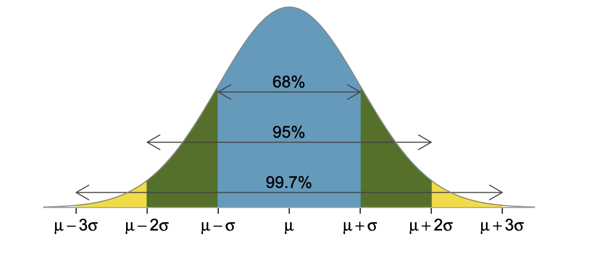

# Статистические методы поиска выбросов

## Понятие выбросов
Одним из этапов очистки данных является поиск выбросов.

**Выброс (аномалия)** - это наблюдение, которое существенно выбивается из общего распределения и сильно отличается от других данных.

В данном разделе рассматриваются статистические методы поиска выбросов, а именно :
* Метод межквартильного размаха
* Метод z- отклонений

## Метод межквартильного размаха


### Алгоритм метода

1. Вычислить 25-ю и 75-ю квантили (1 и 3 квантили) - $Q_{25}$ для признака , который мы исследуем
2. Вычислить межквартильное расстояние:
    * $IQR=Q{75}-Q_{25}$
3. Определить верхную и нижнюю границы Тьюки:

    * $bound_{upper} = Q_{75} + 1.5*IQR$

    * $bound_{lower} = Q_{25} - 1.5*IQR$
4. Найти надлюдения, которые выходят за пределы границ  

### **Недостатки метода:**

Можно попробовать воспользоваться методами преобразования данных, например, логарифмированием, чтобы попвтаться свести распределение к нормальному или хотябы симметричному.

Также можно добавить вариативности колличесству квартильных размахов в левую и правую сторону распределений.


## Метод z-отклонений (метод сигм)

Правило трех сигм гласит: что, если распределение данных является нормальным, то 99.73% лежат в интервале: $(\mu-3\sigma$ , $\mu+3 \sigma)$ , где 
   * $\mu$  - математическое ожидание (для выборки это среднее значение)
   * $\sigma$  -  стандартное отклонение.

Наблюдения, которые лежат за перделами этого интервала будут считаться выбросами.



### **Алгоритм метода:**

1. Вычислить среднее и стандартное отклонение $\mu$ и $\sigma$ для признака, который мы исследуем
2. Определить верхную и нижную границы:
    * $bound_{upper} = \mu - 3 * \sigma$

    * $bound_{lower} = \mu - 3 * \sigma$
3. Найти наблюдения, которые выходят за пределы границ

### **Недостатки метода:**

Можно попробовать воспользоваться методами преобразования данных, например, логарифмированием, что бы попататься свести распределение к нормальному или хотябы симметричному.

Также можно добавить вариативности колличесству квартильных размахов в левую и правую сторону распределений.

## Реализация методов

Методы реализованы в виде функций find_outliers_iqr() и find_outliers_z_score(). Функции представлены в файле find_outliers.py. К функциям предоставлена документация.

## Пример использования

Обязательными аргументами функций, реализующих методы поиска выбросов являются:

   * data(pandas.DataFrame): набор данных(таблица)
   * feature(str): имя признака, на основе которого происходит поиск выбросов

Использование классических подходов без модификаций:
```python
# Метод межквартильного размаха
from outliers_lib.find_outliers import find_outliers_iqr

outliers_iqr, cleaned_iqr = find_outliers_iqr(data, feature)

# Метод z-отклонений
from outliers_lib.find_outliers import find_outliers_z_score

outliers_iqr, cleaned_iqr = find_outliers_z_score(data, feature)
```   
Использование методов с предварительным логарифмированием
```python
outliers_iqr, cleaned_iqr = find_outliers_iqr(data, feature, log=True)
outliers_iqr, cleaned_iqr = find_outliers_z_score(data, feature, log=True)
```
Использование методов с предварительным логарифмированием и добавлением вариативности разброса:
```python
outliers_iqr, cleaned_iqr = find_outliers_iqr(data, feature, log=True, left=2, right=2)
outliers_iqr, cleaned_iqr = find_outliers_z_score(data, feature, log=True, left=2, right=2)
```


## Использованные инструменты и библиотеки
    * numpy (1.20.3)
    * pandas (1.3.4)

## Дополнительные источники:
 * [Нормальное распределение](https://ru.wikipedia.org/wiki/%D0%9D%D0%BE%D1%80%D0%BC%D0%B0%D0%BB%D1%8C%D0%BD%D0%BE%D0%B5_%D1%80%D0%B0%D1%81%D0%BF%D1%80%D0%B5%D0%B4%D0%B5%D0%BB%D0%B5%D0%BD%D0%B8%D0%B5)
 * [Какие существуют методы определения выбросов в данных](https://sky.pro/media/kakie-sushhestvuyut-metody-opredeleniya-vybrosov-v-dannyh/#:~:text=%D0%9C%D0%B5%D1%82%D0%BE%D0%B4%20IQR%20(%D0%BC%D0%B5%D0%B6%D0%BA%D0%B2%D0%B0%D1%80%D1%82%D0%B8%D0%BB%D1%8C%D0%BD%D1%8B%D0%B9%20%D1%80%D0%B0%D0%B7%D0%BC%D0%B0%D1%85)%20%E2%80%94,IQR%20%D0%BE%D1%82%20Q1%20%D0%B8%20Q3.)
   


